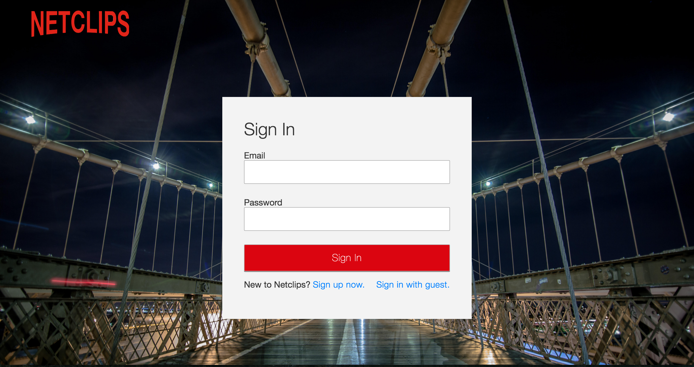
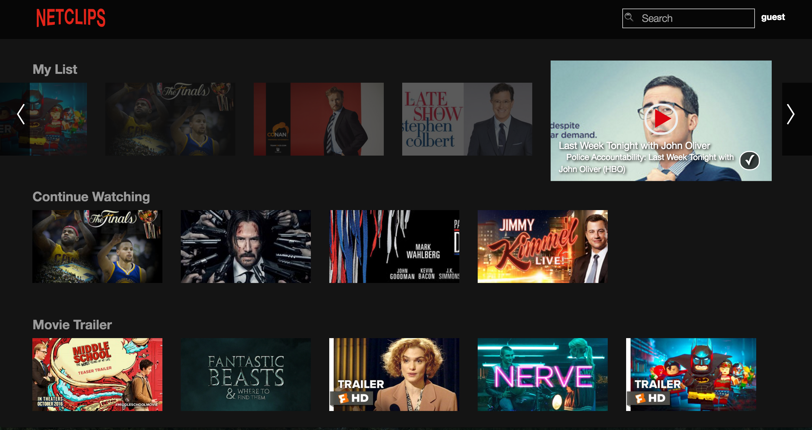
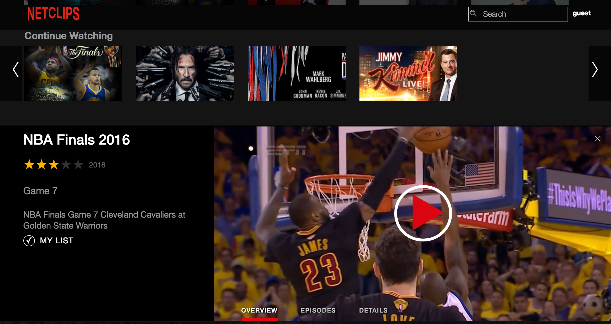
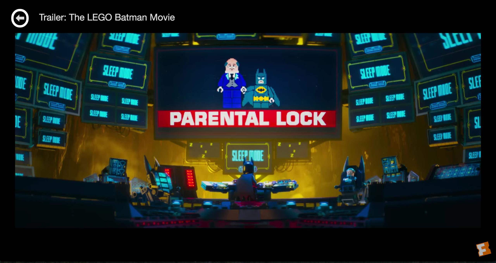
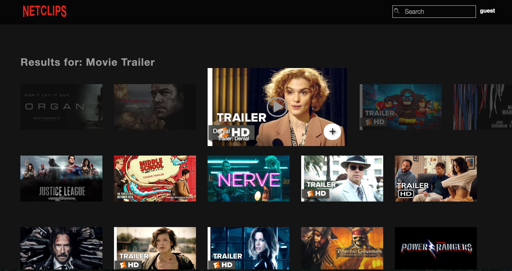
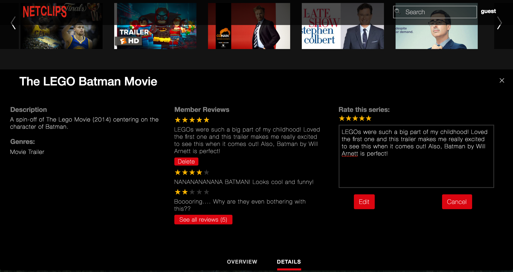
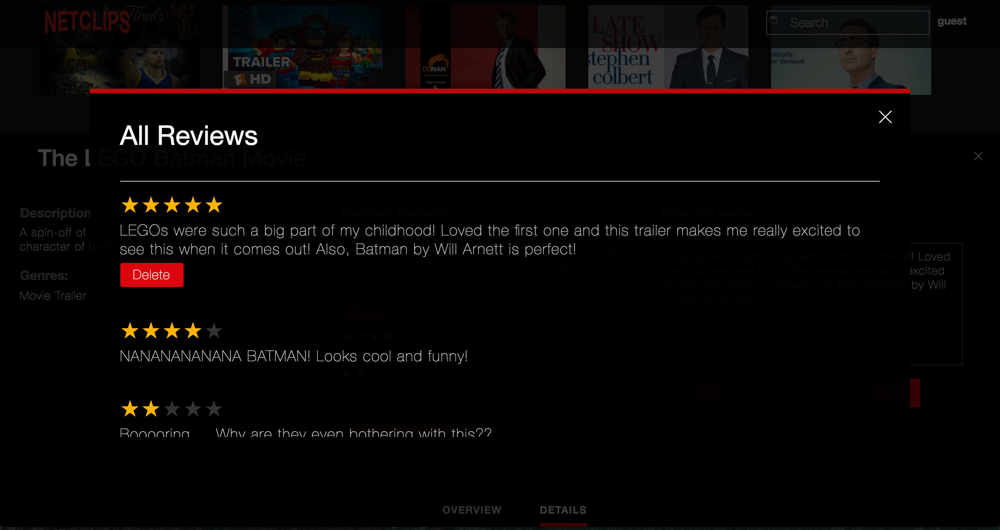

# Netclips

[Netclips live][heroku]

[heroku]: http://netclips.herokuapp.com/

Netclips is a full-stack web application that combines the instant gratification of short video clips and highlights with the binge-watchability of Netflix. The back end of the application was built with Ruby on Rails and a PostgreSQL database. All data fetching was done using AJAX and JBuilder for declaring JSON structures. The front end was created with React.js and JavaScript and utilizes the Redux architectural framework for an optimal single-page user-experience.

## Features & Implementation

### Authentication

  

  Back-end and front-end user authentication was built from scratch by encrypting user password and creating a unique session token for each user on sign up or login. This allows for secure access to one's account on the single-page application which then renders distinct content based on the current user.

### LRU Cache

  One major feature of the application that cannot be seen on the front-end is the LRU cache that I created using a doubly-linked list and POJO. The motivation for implementing an LRU cache is that because a user is likely to flip between his or her favorite videos, sending a query to the database for the same information over and over again would be wasteful.
  To build the LRU cache, I first created a `List` class that holds a link for every cached object (either an array of episodes or a series). A linked list is optimal for this application because it is extremely easy and fast to add, delete, and update links (all O(1) time). The POJO is used as a hash map so indexing through the linked list can be O(1) time as well.

  There are two LRU caches, one in the `episodes_middleware` and the other in the `series_middleware`. They are then used to determine which action the middleware should dispatch and updated to keep track of the most recently used episodes or series.

  `episodes_middleware.js`

  ```javascript
  const episodesCache = new LRUCache(8);

  case REQUEST_EPISODES:
    if (episodesCache.includes(action.serieId)) {
      return dispatch(cachedEpisodes(episodesCache.get(action.serieId)));
    } else {
      return dispatch(grabEpisodes(action.serieId));
    }
  ```

### Videos

  Videos are organized in such a way that allows users to have their own favorite lists and currently watching lists that consists or either 'series', which have multiple 'episodes' or 'movies'. The following overview of the database schema explains how the videos were implemented to allow for episodes nested within a series, the maintained to track favorites and currently watching lists, and the organized on the main index and search results index.

#### Main Index

  

  On the database side, the there are a variety of associations to link together episodes and genres to series so the main index page displays each of the series in their respective genre rows. Additionally, because a series can belong to multiple genres and a genre can have multiple series, a `serie_genres` table was required to allow a many-to-many relationship.
  The series data was sent from the backend without any N+1 queries to the database by using ActiveRecord `includes` and `joins` and the necessary information was selected using JBuilder.

#### Carousel Rows & Series Display

  Building the carousel rows for each genre was one of the more difficult aspects of building this application. Depending on the user, the index must have 4 different capabilities.
  - Expand any given series to display more information right beneath the its respective row
  - Play current episode for any given series (default is the first episode)
  - Search for a series via the search bar or by clicking on a genre
  - Add any given series to a user's 'list' and add it to the store.

  

  In order to implement the automatic opening and closing of a series display in the correct position, a `focusedGenreId` property was implemented such that if a user opens up a new series display in the same row, the display will stay in the same position and render different information. However, if a user opens up a new series display in a different row (i.e. different `genreId`), the existing display will close and the new series will display its information in the correct location.

#### Watching Videos

  

  The video player was created using the react component `react-youtube` and other functions from the YouTube IFrame Player API. One interesting challenge was handling the video player once an video clip ended. In order to make the user experience of Netclips as seamless as possible, the video player will autoplay to the next episode in the series if it exists or render the main index page so the user can find another video to watch.

  Additionally, once a user starts a video clip, it will automatically be added to his or her `currently watching` list. Then if the user finishes the final episode it that series, the series will be automatically removed from the user's `currently watching` list.

  The currently watching aspect of the application was another difficult problem to solve as it involved juggling data from the user, series, and episodes. By utilizing this triple-join table, a user can have many series that he or she is watching and also keep keep track of which episodes he or she is currently on. From the index standpoint, a series can have many current watchers, but for any given session, the user will only be shown the series that he or she is watching.

### Suggestions

  Using Rails' native ORM framework, ActiveRecord, users will be shown 15 suggestions based on their currently watching or favorited videos & series. These suggestions are loaded in when the main index page renders and will update as users add/remove favorites and start/finish videos. The following block is the ActiveRecord query used to get all of the suggested series which also prefetches episodes to avoid sending N+1 SQL queries.

```Ruby
current_watchings = Genre.select(:id).joins(:current_watchings).where("current_watchings.user_id = ?", user.id)
favorites = Genre.select(:id).joins(:favorites).where("favorites.user_id = ?", user.id)

suggestions = Serie.joins(:genres).joins("LEFT JOIN current_watchings ON current_watchings.serie_id = series.id").includes(:episodes, :current_watchings).where("current_watchings.serie_id IS NULL").where("genre_id IN (?) OR genre_id IN (?)", current_watchings, favorites)
```

### Search & My List

  

  The search bar allows a user to search for video clips by either title or genre and renders live search results. Users may also click on a genre to view all series that are tagged with that genre.

  Updating a user's list can be done a couple of places, the index or the series' overview panel. While the user is searching through the index and hovers over a given series, it will scale up and an 'add' button will appear on the lower right corner along with the series title, episode, and play button. However, if the series is already on the user's list, a 'check' button will appear and the user can click to remove the series from his or her list. This was another case where a join table had to be created in order to accommodate for the many-to-many relationship between users and series.

### Ratings & Reviews

  Users can rate reviews from the series' overview panel on the display page or while writing a review. In order to implement this, all of the validations for creating a review had to be done on the front end. When rating a series from the overview panel, no body is required. However, if a user were on the details panel and tried to create a review, the review will not be submitted unless a body is attached to the rating.

  

  Additionally, once a user does rate a series, his or her rating will appear with yellow stars vs. the average rating red stars if the current user has not rated the series. Once a rating is created, it will persist to the review form so that the user will only have to write a review to go along with his or her existing rating.

  The review list will show the first 3 reviews with the user's review at the top. If there are more reviews for that particular series, a button will appear to open a `react-modal` that will display all reviews.

  

### Additional Work

  There are still a couple of features that have yet to be implemented into this application and are listed below:

  - [ ] Suggestions for current user based on previously watched
  - [ ] Notifications for new additions to the database
  - [ ] A feature section on the main index to highlight any new additions
  - [ ] OAuth, Infinite scroll
